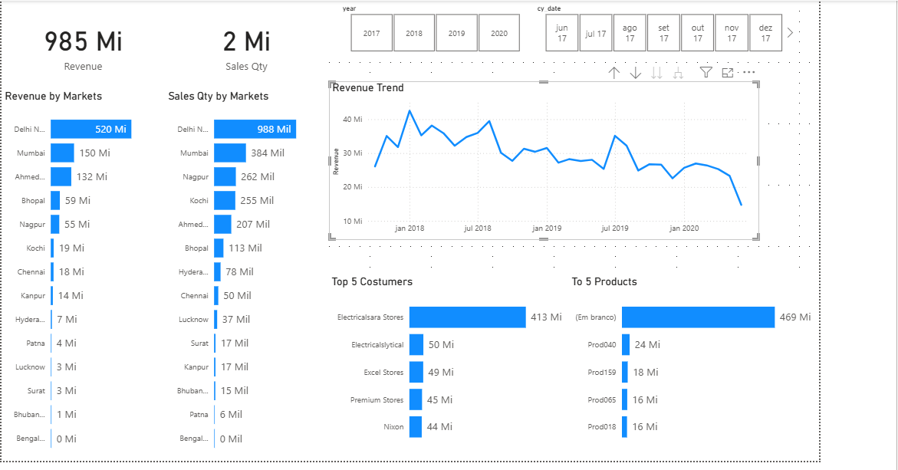

# Project Documentation: AtliQ Hardware - Sales Insights Dashboard

## 1. Project Overview

**Company:** AtliQ Hardware

**Context:** AtliQ Hardware is a key supplier of computer hardware and peripherals to a diverse range of clients.

**Challenge:** The market is experiencing dynamic growth. Consequently, the Sales Director faces significant challenges in tracking sales performance effectively across three different regions in India. Reports from regional managers are often inconsistent, delivered through numerous separate Excel files, leading to confusing insights. The Sales Director requires a consolidated, understandable, high-level view of the business to derive clear, actionable insights.

## 2. Project Goals and Objectives (AIMS Framework)

**Purpose:** To develop an automated analytics solution that unlocks previously hidden sales insights. The goal is to provide robust decision support for the sales team and automate the data gathering process, significantly reducing the manual time currently invested.

**Stakeholders:**
- Sales Director
- Marketing Team
- Regional Sales Managers
- Sales Analysts

**End Result:** An automated Power BI dashboard that provides quick, reliable, and up-to-date sales insights to support data-driven decision-making across the organization.

## 3. Success Criteria

The success of this project will be measured by the following criteria:

- **Insight Delivery:** The dashboard successfully uncovers actionable sales order insights using the latest available data.
- **Improved Decision-Making:** The sales team is able to leverage the dashboard to make more informed decisions, leading to a projected 10% improvement in sales efficiency or cost savings.
- **Time Savings:** Sales Analysts reduce time spent on manual data gathering by 20%, reinvesting this time in value-added analysis and strategic activities.

## 4. Data Source and Preparation

**Data Source:** The data was sourced from the company's sales management system, which operates on a MySQL database. (Reference: Codebasics.io Sales Insights Dataset).

**Data Transformation (Power Query):** The following data cleaning and preparation steps were performed:
- Established a connection to the MySQL database.
- Filtered the dataset to isolate data for the Indian market, as per the project's scope.
- Excluded records with negative or zero values in the sales amount column to ensure data accuracy.
- Created a new column, `norm_sales_amount`, by converting sales figures from USD to Indian Rupees (INR) for localized analysis.
- Removed duplicate records to maintain data integrity.

## 5. Dashboard Functionality and Visuals

The Sales Analysis Dashboard provides a consolidated and interactive view of the company's commercial performance. Its primary objective is to monitor revenue and sales quantity, identifying trends, key markets, top customers, and high-impact products.

### Key Performance Indicators (KPIs):
The dashboard leads with two primary KPI cards summarizing overall performance:
- **Total Revenue:** Displays the total accumulated revenue for the selected period.
- **Sales Quantity:** Shows the total number of units sold.

### Filters and Interactivity:
The report features dynamic slicers for data segmentation:
- **Year Filter:** Allows users to select one or more years (2017-2020) for analysis.
- **Month Filter:** Enables users to drill down into specific months within the selected year.

### Visualizations Analysis:

#### Revenue by Markets & Sales Qty by Markets
- **Type:** Horizontal Bar Charts.
- **Description:** These charts rank the markets (cities) based on the revenue generated and the quantity of products sold, respectively. They allow for a direct comparison of performance across different locations.

#### Revenue Trend
- **Type:** Line Chart.
- **Description:** This visual displays the monthly revenue trend over time, making it ideal for identifying seasonality, peaks, and dips in sales performance.

#### Top 5 Customers
- **Type:** Horizontal Bar Chart.
- **Description:** This chart ranks the top 5 customers by the total revenue they have generated.

## 6. Dashboard Preview  

  
